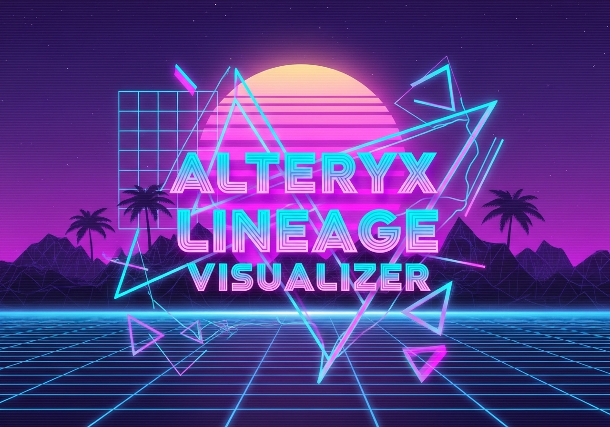

# Alteryx Lineage Visualizer (Desktop)



## 1. High-Level Goal

This is a self-contained desktop application designed to parse Alteryx workflow files (`.yxmd`) and build an interactive data lineage map. It uses a shared SQLite database file (called a "workspace"), allowing a team to collaboratively visualize workflow inputs, outputs, and dependencies, and to identify critical workflows within your data ecosystem.

---

## 2. Key Features

* **Shared Workspaces:** Create, open, or connect to a shared SQLite database file on a local or network drive.
* **Welcome Screen:** Easily access your 5 most recent workspaces.
* **Drag & Drop:** Simply drag your `.yxmd` files onto the main window to automatically parse and add them to the lineage map.
* **Impact Analysis:** Automatically calculates a "Criticality Score" for each workflow based on its total downstream dependencies, helping you identify the most critical parts of your data ecosystem.
* **Multiple Views:**
    * **Graph View:** An interactive, force-directed graph powered by D3.js. Nodes can be moved, inspected, and searched.
    * **Report View:** A clear, list-based view of all workflow inputs and outputs.
    * **Impact View:** A ranked table of all workflows by their "Criticality Score".
* **Workflow Management:** Add or delete workflows from your workspace. Deletion includes a confirmation step to prevent accidents.
* **Quick Navigation:** Jump directly from the Impact Analysis report to any workflow in the Graph or Report views.
* **Data Source Aliasing:** Give user-friendly names to cryptic database connections or file paths.
* **Integrated Help:** Access the `USAGE.md` guide directly from the "Help" menu.

---

## 3. Installation

Download the [latest release](https://github.com/wrjones104/alteryx-lineage-desktop/releases/latest) and unzip anywhere on your computer. Run alteryx-lineage-desktop.exe to launch the application.

---

## 4. Tech Stack

* **Framework:** Electron
* **Database:** SQLite3
* **Frontend:** HTML, CSS, JavaScript
* **Visualization:** D3.js
* **Styling:** TailwindCSS (via CDN)
* **Settings:** electron-store

---

## 5. Setup for Development

To run this application in a development environment:

1.  **Clone the repository:**
    ```sh
    git clone [https://github.com/wrjones104/alteryx-lineage-desktop.git](https://github.com/wrjones104/alteryx-lineage-desktop.git)
    ```
2.  **Navigate to the project directory:**
    ```sh
    cd alteryx-lineage-desktop
    ```
3.  **Install dependencies:**
    ```sh
    npm install
    ```
4.  **Run the application:**
    ```sh
    npm start
    ```

---

## 6. Building the Portable Application

This project is configured to build a portable application that does not require an installation process.

1.  **Run the build command:**
    ```sh
    npm run make
    ```
2.  This command will package the application and create the distributables in the `/out` folder. The output for Windows will be located in `out/make/zip/win32-x64`.

---

## 7. How to Use the Final App

1.  Unzip the application folder generated by the build process. You can place this folder anywhere, including on a shared network drive.
2.  Launch the application by double-clicking the `alteryx-lineage-desktop.exe` file.
3.  From the welcome screen, choose one of the options:
    * **Create New Workspace:** Creates a new `.sqlite` database file.
    * **Open Existing Workspace:** Opens a pre-existing `.sqlite` workspace file.
    * **Recent Workspaces:** Click on a file from the list to open it directly.
4.  Once in the main view, click the "Add Workflow" button and drag and drop your `.yxmd` files onto the modal to populate the lineage map.